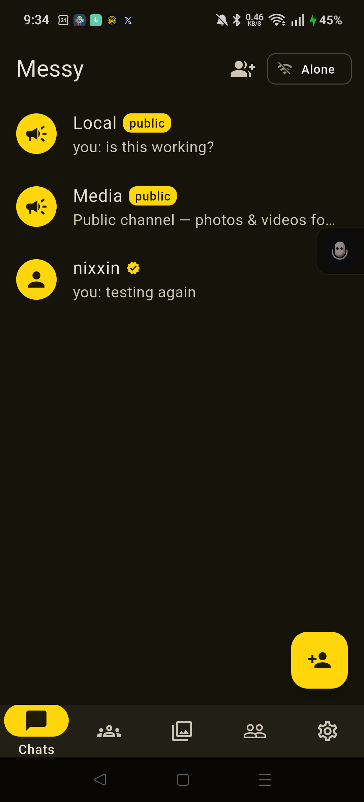
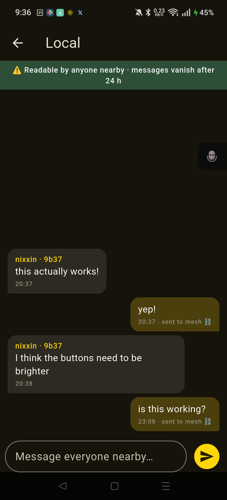
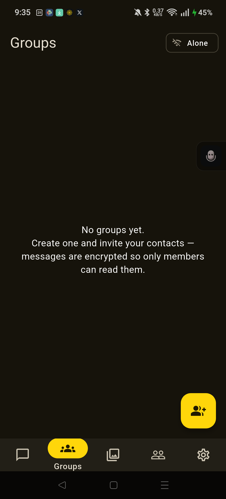
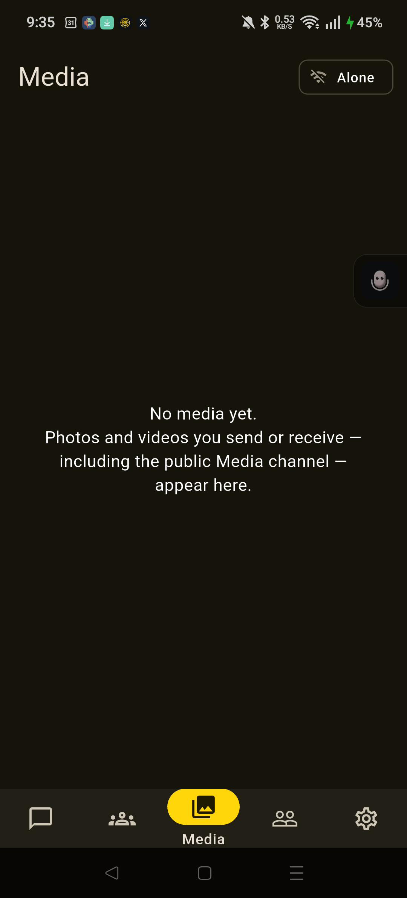
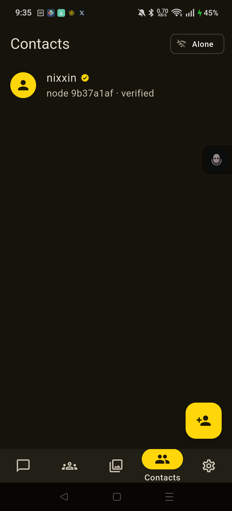
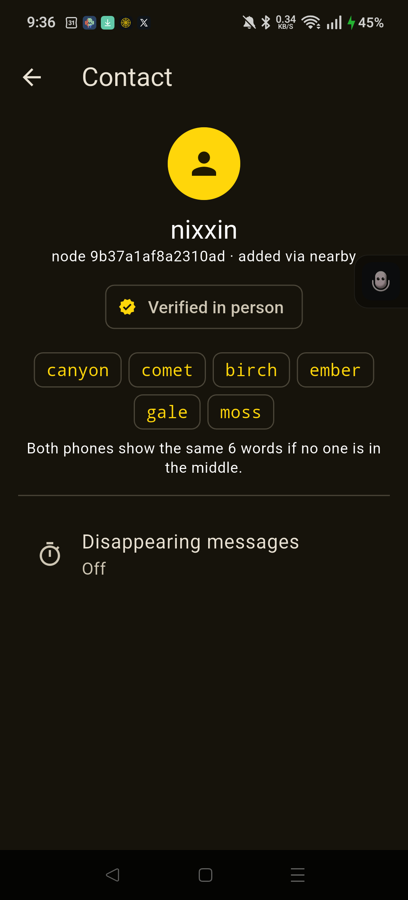
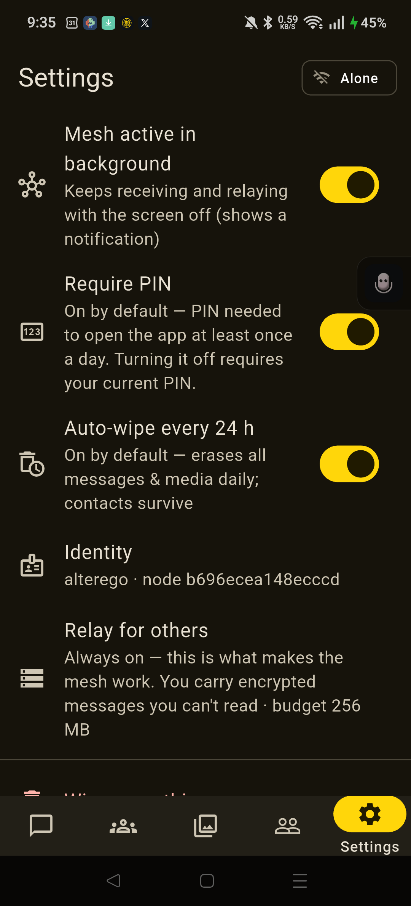

### 📦 [**Download the APK — latest release**](https://github.com/nixxintools/messy-app/releases/download/v2.7.0/messy.apk) · Android 10+, sideload directly, no Play Store needed · [Previous releases](https://github.com/nixxintools/messy-app/releases/latest)

---

<p align="center">
  
</p>

# Messy

**Secure messaging for the mountains, festivals, planes, and crowds — anywhere the mobile network can't reach or can't keep up.**

## Why Messy exists

Sometimes there's simply no network: a trail deep in the mountains, a long-haul flight, a campsite past the last cell tower. And sometimes there's a network that can't cope: a big festival or stadium where 40,000 phones hit one tower and suddenly nothing sends, while you stand 200 meters from your friends unable to tell them where you are.

Messy is built for exactly that moment. It doesn't use the mobile network at all:

- **One person turns on their phone's hotspot** — no internet needed, the hotspot itself is the network. Everyone who joins it can message each other instantly.
- **Messages hop between phones.** If your friend isn't on your hotspot, your message is carried — encrypted — by other Messy users' phones until it reaches them. Someone walking from the main stage to the campsite physically carries messages with them.
- **A public "Local" room** works like a bulletin board for everyone nearby: "water station moved to hall B", "anyone near the north gate?"
- **Photos and videos** travel the same way, chunked and resumable, so a dropped connection mid-transfer picks up where it left off.

No account. No phone number. No servers. Nothing to sign up for — you pick a name, and your phone generates its own cryptographic identity.

## Security first

Messy starts locked down and lets *you* decide to loosen it — never the other way around:

- **PIN lock, on by default.** You set a PIN during onboarding; it's required to open the app at least once a day. You can turn it off in Settings (which itself requires the PIN).
- **End-to-end encryption.** Every 1:1 message is sealed with X25519 + AES-256-GCM. The phones that relay your messages across the crowd can never read them — they carry opaque ciphertext. Texts also get **forward secrecy** via one-time prekeys (burned after use).
- **Authenticated public rooms + moderation.** Posts to Local/Media are Ed25519-signed (no impersonating a contact); you can block/mute a sender, and blocks are shared among your verified contacts (web-of-trust). Public media never auto-downloads.
- **Auto-wipe, on by default.** Everything — messages, photos, relayed data — is erased every 24 hours. Contacts and your identity survive. There's also a "wipe everything now" button.
- **Disappearing messages** per chat: 1 hour, 24 hours, or 7 days.
- **Local-only storage.** One SQLite database on your phone (with `secure_delete` on), no cloud, no backups, no telemetry. Nothing ever leaves your device except encrypted envelopes to peers.
- **Verified contacts.** Scan each other's QR codes in person and the app marks the contact verified — the keys came from a phone you could see. Contacts added over the air get a 6-word fingerprint phrase both of you can compare aloud.

- **Hardened at rest.** The database is **encrypted with SQLCipher** (key held in the Android Keystore) — OTK secrets and routing metadata are never plaintext on disk; the app refuses to run if encryption isn't active. The PIN is **Argon2id**-hashed with rate-limited lockout. Optional `FLAG_SECURE` blocks screenshots.

> ⚠️ **Not audited.** Messy was built fast and has had **no professional security review**. It's promising but unproven — don't rely on it where a compromise could put someone at risk; use a mature audited tool (e.g. Signal) for high-stakes needs. The honest fine print, including what Messy does *not* protect (no post-compromise security, relays see who-talks-to-whom, public rooms are readable by anyone running the app, radios unverified on hardware), is in [docs/SECURITY.md](docs/SECURITY.md).

## How it works

```
your phone ──Wi-Fi/hotspot──> nearby phones ──carried ciphertext──> their phone
     └── everything end-to-end encrypted; relays see only envelopes ──┘
```

- **Transports (run in parallel, fastest wins):** Wi-Fi/hotspot (TCP), Bluetooth LE, Wi-Fi Aware, and Wi-Fi Direct — all behind one `Link` abstraction. Every transport's link to a peer stays live at once; the router forwards over the cheapest and fails over instantly when one drops. This is what keeps coverage consistent across mixed handsets (a budget phone with no Wi-Fi Aware rides BLE + Wi-Fi Direct; a flagship uses the faster path; they interoperate).
- **Discovery:** UDP broadcast beacons on the local subnet (a hotspot *is* a subnet), plus each radio's own peer discovery.
- **Links:** every link runs an Ed25519-signed handshake — nobody can impersonate a node ID.
- **Routing:** epidemic store-and-forward with TTL, dedupe by UUIDv7 message ID, a 256 MB relay budget, and gossiped delivery receipts. The UI never lies: *queued → sent to mesh → ✓✓ delivered*.
- **Media:** 32 KiB chunks, each independently encrypted, SHA-256-verified on reassembly, 25 MB cap.

Full design: [docs/ARCHITECTURE.md](docs/ARCHITECTURE.md) · wireframes: [docs/wireframes.html](docs/wireframes.html)

## Screenshots

<table>
<tr>
<td><br><sub>Chat list</sub></td>
<td><br><sub>Local room</sub></td>
<td><br><sub>Groups</sub></td>
<td><br><sub>Media gallery</sub></td>
</tr>
<tr>
<td><br><sub>Contacts</sub></td>
<td><br><sub>Fingerprint verification</sub></td>
<td><br><sub>Settings</sub></td>
<td></td>
</tr>
</table>

Screens taken from the app running live on a real two-phone mesh test. More mockups (onboarding, add-contact/QR flow) in [docs/wireframes.html](docs/wireframes.html).

## Status

Working (Android) — current release **v2.5.0**:

- ✅ PIN gate (mandatory setup, daily re-entry, off-switch in Settings)
- ✅ Identity + QR / nearby contact exchange
- ✅ Encrypted 1:1 text over any shared Wi-Fi or phone hotspot
- ✅ Public "Local" room with 24 h expiry
- ✅ Encrypted groups — invite contacts, messages relay through any phone but only members hold the key
- ✅ Store-and-forward mesh relaying (always on — it's what makes the mesh work)
- ✅ Photo/video transfer with resume · videos auto-compressed to 720p
- ✅ Disappearing messages + 24 h auto-wipe (on by default)
- ✅ Background mesh: foreground service keeps receiving/relaying with the screen off
- ✅ Forward secrecy for 1:1 texts via one-time prekeys — issued per peer, replenished in-band, burned after use (see [SECURITY.md](docs/SECURITY.md))
- ✅ Authenticated public/group posts (Ed25519) — no impersonating a contact in Local
- ✅ Moderation: block/mute a sender (hides, purges, stops relaying them), per-sender relay rate limiting, and web-of-trust blocklists shared among verified contacts
- ✅ No auto-download in the public Media channel — tap-to-view placeholder for unverified media; delete any received media
- ✅ **Hybrid infrastructure-free mesh** — messages hop phone-to-phone across separate hotspots/networks with no shared AP, via complementary radios that run **in parallel with automatic failover** (the FireChat/Open Garden hybrid approach):
  - **Bluetooth LE** — universal, low-power: each phone is at once a BLE peripheral and central, forming chains by proximity. The everywhere-baseline.
  - **Wi-Fi Aware (NAN)** — high-throughput native transport (adapted from [NodleCode's reference](https://github.com/NodleCode/wifi-aware)): peers form a data-path socket with no AP; carries media fast where hardware supports it.
  - **Wi-Fi Direct** — broadest-support no-AP path (native `WifiP2pManager`), for budget handsets that lack Wi-Fi Aware. Forms a group and runs a socket over it.
  - All run alongside Wi-Fi/hotspot behind one transport abstraction; the router keeps every transport's link to a peer live **in parallel** and forwards over the fastest, failing over instantly when one drops.
  - ⚠️ **The three radios (BLE, Wi-Fi Aware, Wi-Fi Direct) are integrated and compile/test clean but are not yet verified on hardware** — they need on-device field testing across multiple handsets. The Wi-Fi/hotspot path is the proven one. See [ARCHITECTURE.md](docs/ARCHITECTURE.md).
- ✅ **Startup radio gate** — prompts to enable Bluetooth + Wi-Fi before the mesh runs (both cover the transports; hotspot is suggested situationally, not required). Verified on device.
- ⏳ Roadmap: on-device field-testing of the three radios, opportunistic internet P2P (WebRTC, serverless), post-compromise security (ratcheting), forward secrecy for media via per-transfer keys

## Build & run

```sh
flutter pub get
dart run build_runner build     # drift codegen
flutter test
flutter run                     # Android device/emulator
flutter build apk --release     # shareable APK
```

Try the mesh with two phones on one Wi-Fi network — or turn on one phone's hotspot and join the other to it. Three phones show off relaying: A ↔ C through B, with B unable to read a word.

## License

[MIT](LICENSE) — free to use, modify, and distribute.
